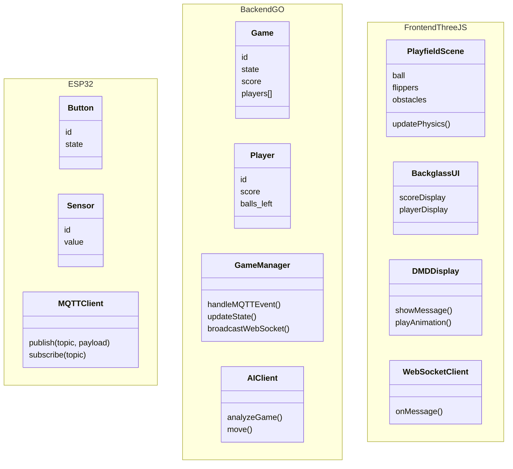

```mermaid
classDiagram
  namespace ESP32 {
    class Button {
      id
      state
    }
    class Sensor {
      id
      value
    }
    class MQTTClient {
      publish(topic, payload)
      subscribe(topic)
    }
  }

  namespace BackendGO {
    class Game {
      id
      state
      score
      players[]
    }
    class Player {
      id
      score
      balls_left
    }
    class GameManager {
      handleMQTTEvent()
      updateState()
      broadcastWebSocket()
    }
    class AIClient {
      analyzeGame()
      move()
    }
  }

  namespace FrontendThreeJS {
    class PlayfieldScene {
      ball
      flippers
      obstacles
      updatePhysics()
    }
    class BackglassUI {
      scoreDisplay
      playerDisplay
    }
    class DMDDisplay {
      showMessage()
      playAnimation()
    }
    class WebSocketClient {
      onMessage()
    }
  }
```
