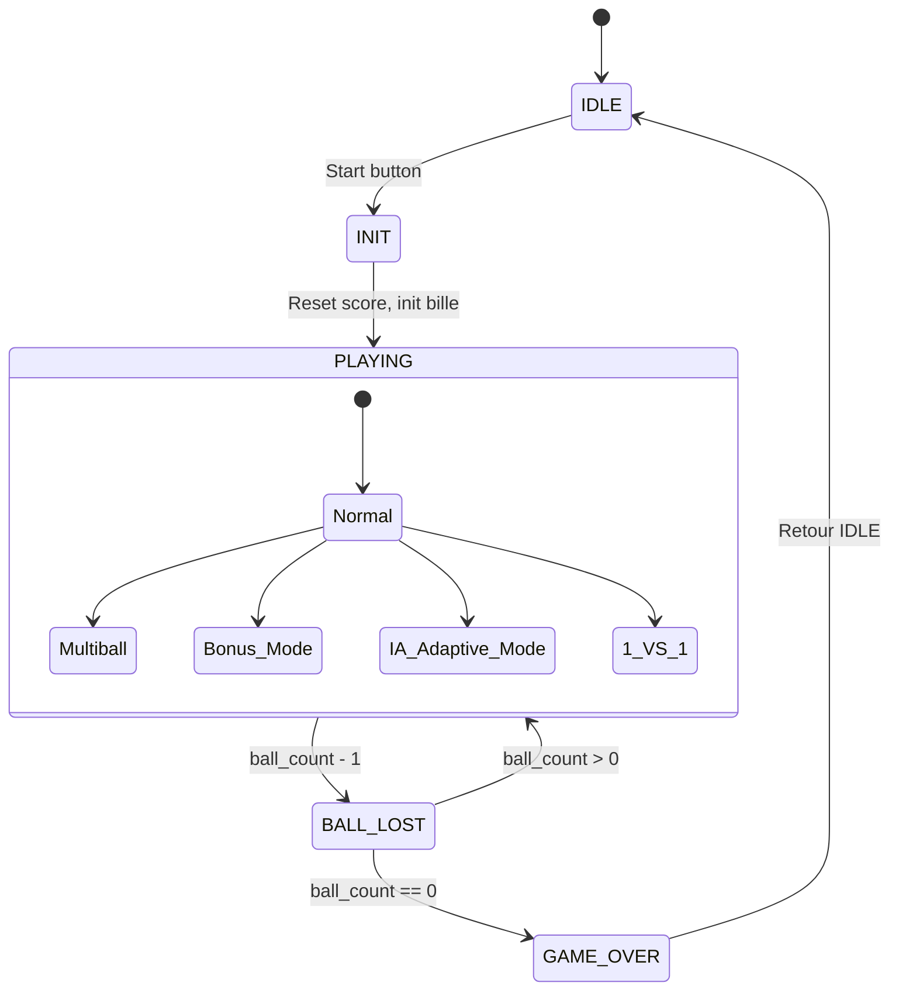

```mermaid
stateDiagram-v2
  [*] --> IDLE
  IDLE --> INIT: Start button
  INIT --> PLAYING: Reset score, init bille

  state PLAYING {
    [*] --> Normal
    Normal --> Multiball
    Normal --> Bonus_Mode
    Normal --> IA_Adaptive_Mode
    Normal --> 1_VS_1
  }

  PLAYING --> BALL_LOST: ball_count - 1
  BALL_LOST --> PLAYING: ball_count > 0
  BALL_LOST --> GAME_OVER: ball_count == 0

  GAME_OVER --> IDLE: Retour IDLE
```