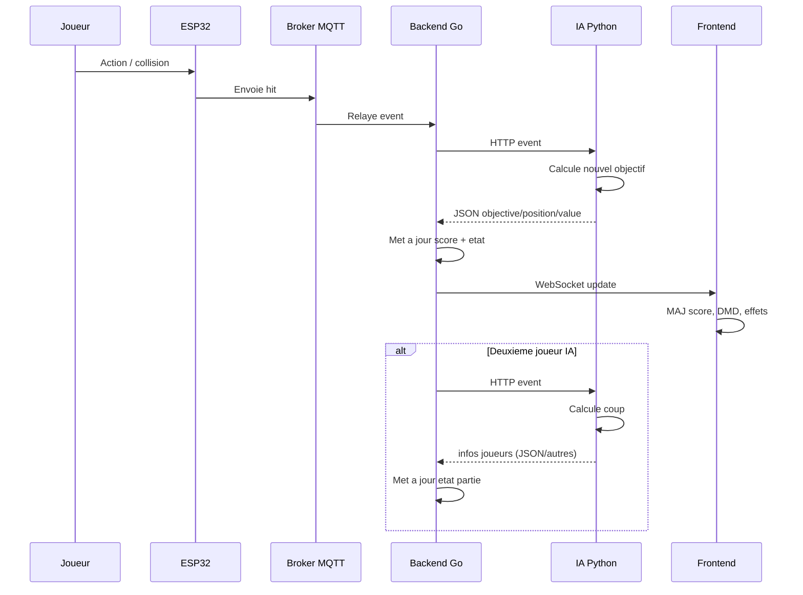

```mermaid
sequenceDiagram
  participant Joueur
  participant ESP32
  participant MQTT as Broker MQTT
  participant Backend as Backend Go
  participant IA as IA Python
  participant Frontend

  Joueur->>ESP32: Action / collision
  ESP32->>MQTT: Envoie hit
  MQTT->>Backend: Relaye event
  Backend->>IA: HTTP event
  IA->>IA: Calcule nouvel objectif
  IA-->>Backend: JSON objective/position/value
  Backend->>Backend: Met a jour score + etat
  Backend->>Frontend: WebSocket update
  Frontend->>Frontend: MAJ score, DMD, effets

  alt Deuxieme joueur IA
    Backend->>IA: HTTP event
    IA->>IA: Calcule coup
    IA-->>Backend: infos joueurs (JSON/autres)
    Backend->>Backend: Met a jour etat partie
  end
```
