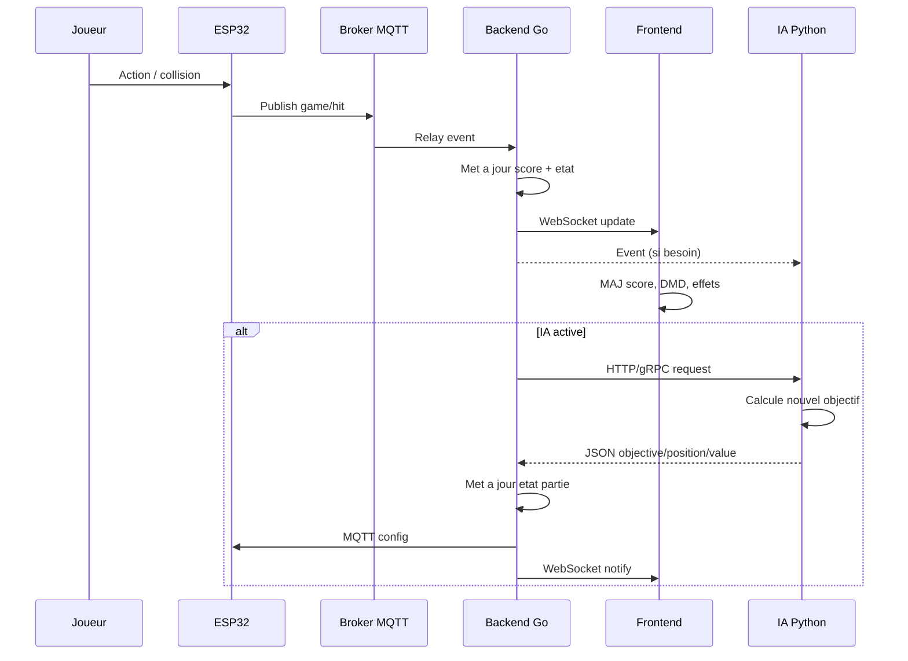

```mermaid
sequenceDiagram
  participant Joueur
  participant ESP32
  participant MQTT as Broker MQTT
  participant Backend as Backend Go
  participant Frontend
  participant IA as IA Python

  Joueur->>ESP32: Action / collision
  ESP32->>MQTT: Publish game/hit
  MQTT->>Backend: Relay event
  Backend->>Backend: Met a jour score + etat
  Backend->>Frontend: WebSocket update
  Backend-->>IA: Event (si besoin)
  Frontend->>Frontend: MAJ score, DMD, effets

  alt IA active
    Backend->>IA: HTTP/gRPC request
    IA->>IA: Calcule nouvel objectif
    IA-->>Backend: JSON objective/position/value
    Backend->>Backend: Met a jour etat partie
    Backend->>ESP32: MQTT config
    Backend->>Frontend: WebSocket notify
  end
```
