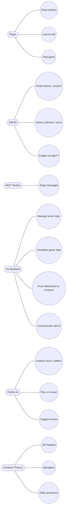

```mermaid
flowchart LR
  Player([Player])
  ESP32([ESP32])
  MQTT([MQTT Broker])
  Backend([Go Backend])
  AI([Python AI])
  Frontend([Frontend Three.js])

  UC1((Press buttons))
  UC2((Launch ball))
  UC3((Play game))
  UC4((Read buttons / sensors))
  UC5((Detect collisions / score))
  UC6((Publish via MQTT))
  UC7((Relay messages))
  UC8((Manage server logic))
  UC9((Centralize game state))
  UC10((Push WebSocket to frontend))
  UC11((Communicate with AI))
  UC12((Analyze score / pattern))
  UC13((Play vs human))
  UC14((Suggest events))
  UC15((3D Playfield))
  UC16((Backglass))
  UC17((DMD animations))

  Player --- UC1
  Player --- UC2
  Player --- UC3

  ESP32 --- UC4
  ESP32 --- UC5
  ESP32 --- UC6

  MQTT --- UC7

  Backend --- UC8
  Backend --- UC9
  Backend --- UC10
  Backend --- UC11

  AI --- UC12
  AI --- UC13
  AI --- UC14

  Frontend --- UC15
  Frontend --- UC16
  Frontend --- UC17
```
