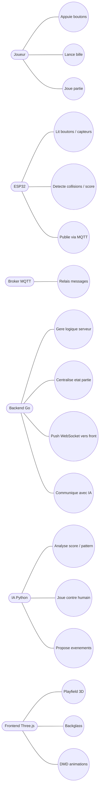

```mermaid
flowchart LR
  Joueur([Joueur])
  ESP32([ESP32])
  MQTT([Broker MQTT])
  Backend([Backend Go])
  IA([IA Python])
  Frontend([Frontend Three.js])

  UC1((Appuie boutons))
  UC2((Lance bille))
  UC3((Joue partie))
  UC4((Lit boutons / capteurs))
  UC5((Detecte collisions / score))
  UC6((Publie via MQTT))
  UC7((Relais messages))
  UC8((Gere logique serveur))
  UC9((Centralise etat partie))
  UC10((Push WebSocket vers front))
  UC11((Communique avec IA))
  UC12((Analyse score / pattern))
  UC13((Joue contre humain))
  UC14((Propose evenements))
  UC15((Playfield 3D))
  UC16((Backglass))
  UC17((DMD animations))

  Joueur --- UC1
  Joueur --- UC2
  Joueur --- UC3

  ESP32 --- UC4
  ESP32 --- UC5
  ESP32 --- UC6

  MQTT --- UC7

  Backend --- UC8
  Backend --- UC9
  Backend --- UC10
  Backend --- UC11

  IA --- UC12
  IA --- UC13
  IA --- UC14

  Frontend --- UC15
  Frontend --- UC16
  Frontend --- UC17
```
