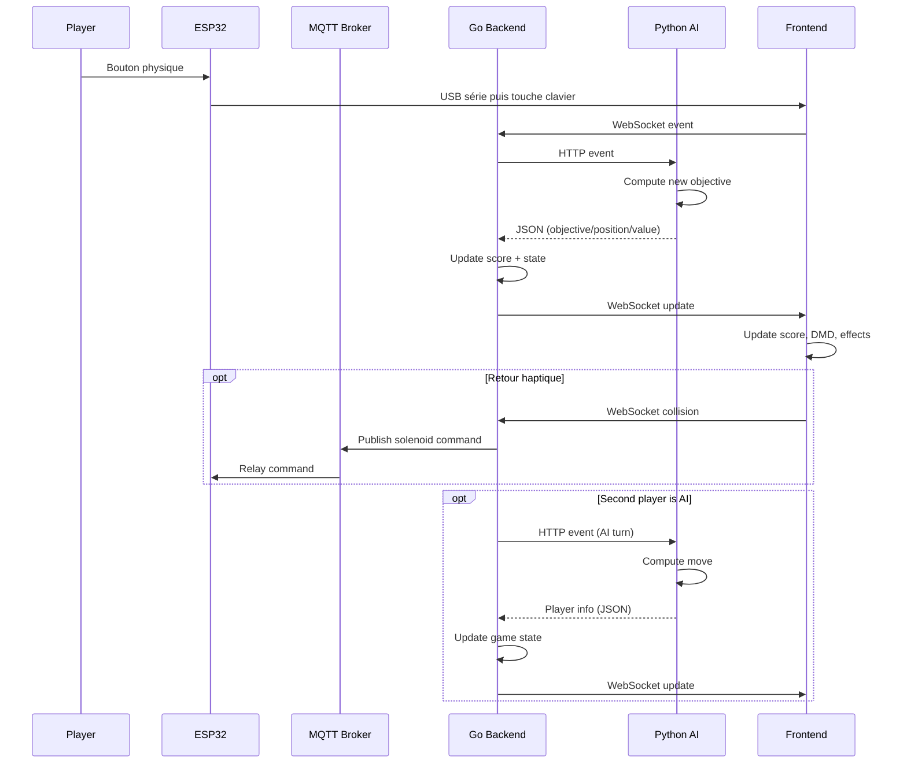

```mermaid
sequenceDiagram
  participant Player
  participant ESP32
  participant MQTT as MQTT Broker
  participant Backend as Go Backend
  participant AI as Python AI
  participant Frontend

  Player->>ESP32: Bouton physique
  ESP32->>Frontend: USB série puis touche clavier
  Frontend->>Backend: WebSocket event
  Backend->>AI: HTTP event
  AI->>AI: Compute new objective
  AI-->>Backend: JSON (objective/position/value)
  Backend->>Backend: Update score + state
  Backend->>Frontend: WebSocket update
  Frontend->>Frontend: Update score, DMD, effects

  opt Retour haptique
    Frontend->>Backend: WebSocket collision
    Backend->>MQTT: Publish solenoid command
    MQTT->>ESP32: Relay command
  end

  opt Second player is AI
    Backend->>AI: HTTP event (AI turn)
    AI->>AI: Compute move
    AI-->>Backend: Player info (JSON)
    Backend->>Backend: Update game state
    Backend->>Frontend: WebSocket update
  end
```
