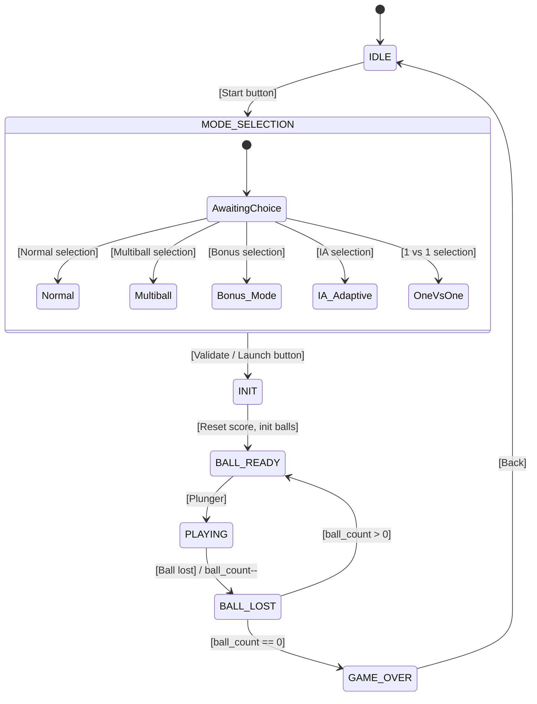

```mermaid
stateDiagram-v2
  [*] --> IDLE
  IDLE --> MODE_SELECTION: [Start button]

  state MODE_SELECTION {
    [*] --> AwaitingChoice
    AwaitingChoice --> Normal: [Normal selection]
    AwaitingChoice --> Multiball: [Multiball selection]
    AwaitingChoice --> Bonus_Mode: [Bonus selection]
    AwaitingChoice --> IA_Adaptive: [IA selection]
    AwaitingChoice --> OneVsOne: [1 vs 1 selection]
  }

  MODE_SELECTION --> INIT: [Validate / Launch button]
  INIT --> BALL_READY: [Reset score, init balls]
  BALL_READY --> PLAYING: [Plunger]

  PLAYING --> BALL_LOST: [Ball lost] / ball_count--
  BALL_LOST --> BALL_READY: [ball_count > 0]
  BALL_LOST --> GAME_OVER: [ball_count == 0]

  GAME_OVER --> IDLE: [Back]
```